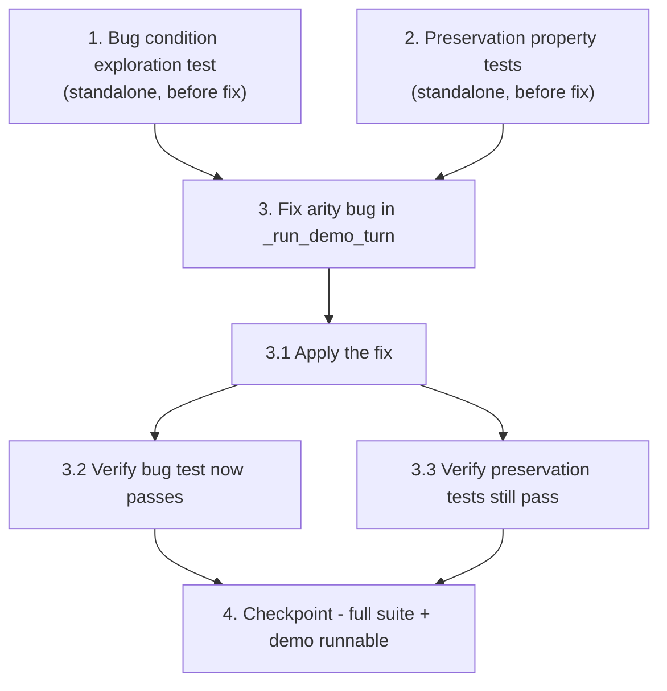

# Implementation Plan

## Overview

This plan fixes an arity bug in `_run_demo_turn` where the empty/unintelligible-transcript guard returns a 4-tuple instead of the 5-tuple every other path returns, causing a Gradio output-count mismatch end-to-end (6 vs 7). The exploratory bugfix flow writes a failing bug-condition test and passing preservation tests first (to confirm the bug and lock in baseline behavior), then applies a one-line fix that appends the missing biomarkers element, and finally re-runs both test sets plus the full suite to confirm the bug is resolved with no regressions.

## Task Dependency Graph



```json
{
  "waves": [
    {
      "wave": 1,
      "tasks": ["1", "2"]
    },
    {
      "wave": 2,
      "tasks": ["3", "3.1", "3.2", "3.3"]
    },
    {
      "wave": 3,
      "tasks": ["4"]
    }
  ]
}
```

Tasks 1 and 2 are standalone and can run in parallel; both must complete before the fix. Task 3 depends on tasks 1 and 2 (3.1 applies the fix, 3.2 re-runs task 1's test, 3.3 re-runs task 2's tests). Task 4 depends on task 3.

## Tasks

- [ ] 1. Write bug condition exploration test (BEFORE implementing fix)
  - **Property 1: Bug Condition** - Empty/Unintelligible Transcript Arity Bug
  - **CRITICAL**: This test MUST FAIL on unfixed code - failure confirms the bug exists
  - **DO NOT attempt to fix the test or the code when it fails**
  - **NOTE**: This test encodes the expected behavior - it will validate the fix when it passes after implementation
  - **GOAL**: Surface counterexamples that demonstrate the arity bug (one guard returns a 4-tuple)
  - **Scoped PBT Approach**: This is a deterministic bug, so scope the property to the concrete failing cases where the resolved transcript is empty or whitespace-only (`isBugCondition(input)` is true)
  - Add tests to `tests/test_webapp.py` following existing patterns (`init_session`, `patch.object(webapp.hear, "transcribe", ...)`, `NEBIUS_API_KEY=""`)
  - Test case 1 — Empty audio transcript: mock `webapp.hear.transcribe` → `("", {"wpm": 0.0, "avg_pause_s": 0.0})`, call `webapp._run_demo_turn(...)` with a fresh session, assert `len(result) == 5` and `result[0]` contains "try again" and `result[4].startswith("### 📊 Acoustic Biomarkers")`
  - Test case 2 — Whitespace audio transcript: mock `transcribe` → `("   ", metrics)`, same assertions
  - Test case 3 — End-to-end arity: call `webapp.run_demo_turn(...)` with the same empty-transcript mock, assert `len(result) == 7` (no Gradio output-count mismatch)
  - Run test on UNFIXED code
  - **EXPECTED OUTCOME**: Tests FAIL (this is correct - unfixed `_run_demo_turn` returns a 4-tuple and `run_demo_turn` returns a 6-tuple, proving the bug exists)
  - Document counterexamples: `_run_demo_turn(...)` returns `len == 4` for empty transcript; `run_demo_turn(...)` returns `len == 6` end-to-end; root cause is the `if not transcript.strip():` guard omitting the biomarkers string
  - Mark task complete when test is written, run, and failure is documented
  - _Requirements: 1.1, 1.2, 1.3, 2.1, 2.2, 2.3_

- [ ] 2. Write preservation property tests (BEFORE implementing fix)
  - **Property 2: Preservation** - Non-Buggy Input Paths Unchanged
  - **IMPORTANT**: Follow observation-first methodology - observe behavior on UNFIXED code, then assert it
  - Add tests to `tests/test_webapp.py` covering each non-buggy path (cases where `isBugCondition` returns false)
  - Observe: normal distress-phrase turn ("I fell down earlier and I'm scared") returns a 5-tuple with transcript+reply, reply audio, updated history, caregiver panel, and a biomarkers string → write test asserting `len == 5`, transcript+reply content present, reply audio not None (Requirement 3.1)
  - Observe: no-input turn (`audio_in=None`, no text) returns a 5-tuple with "Record audio or type what Dad says first." and "_No audio detected_" biomarkers → write test asserting `len == 5` and those contents (Requirement 3.2)
  - Observe: rate-limited turn (exceed daily cap) returns a 5-tuple with the rate-limit message and "_Rate limited_" biomarkers → write test asserting `len == 5` and those contents (Requirement 3.3)
  - Observe: distress/fall offline fast-path still produces the caregiver flag, disclosure banner, and reply audio → confirm existing tests cover this; add explicit assertion if needed (Requirement 3.4)
  - Property-based framing: for any transcript the resolver yields on a non-buggy path, `len(_run_demo_turn(...)) == 5`. (Project uses stdlib `unittest` only; approximated by one representative example per non-buggy path per design Testing Strategy)
  - Run tests on UNFIXED code
  - **EXPECTED OUTCOME**: Tests PASS (this confirms the baseline behavior to preserve - these paths already return the correct 5-tuple)
  - Mark task complete when tests are written, run, and passing on unfixed code
  - _Requirements: 3.1, 3.2, 3.3, 3.4_

- [ ] 3. Fix empty/unintelligible-transcript arity bug in `_run_demo_turn`

  - [ ] 3.1 Add the missing 5th biomarkers element to the empty-transcript guard
    - In `webapp.py`, locate the `if not transcript.strip():` guard inside `_run_demo_turn`
    - Change the return from the 4-tuple `("Couldn't make out any speech or text -- try again.", None, history, panel())` to a 5-tuple that appends the biomarkers string `"### 📊 Acoustic Biomarkers\n_No audio detected_"`, matching the no-input path convention
    - Make no other changes: `run_demo_turn`, the Gradio wiring (7 outputs), function signatures, and all other return paths stay untouched (the fix is one return statement)
    - Keep the demo runnable per AGENTS.md (`python webapp.py` launches cleanly; no imports, globals, or layout changes)
    - _Bug_Condition: isBugCondition(input) where resolveTranscript(input) is not null AND trim(transcript) = "" (control reaches the `if not transcript.strip():` guard)_
    - _Expected_Behavior: _run_demo_turn returns a 5-tuple whose first element contains the "try again" message and whose 5th element is a valid biomarkers panel string, so run_demo_turn yields 7 elements and Gradio renders without an output-count mismatch_
    - _Preservation: all paths where isBugCondition is false (normal turn, no-input, rate-limited, API-key-paused) remain byte-for-byte unchanged in shape and content_
    - _Requirements: 2.1, 2.2, 2.3_

  - [ ] 3.2 Verify bug condition exploration test now passes
    - **Property 1: Expected Behavior** - Empty/Unintelligible Transcript Arity Bug
    - **IMPORTANT**: Re-run the SAME test from task 1 - do NOT write a new test
    - The test from task 1 encodes the expected behavior; when it passes it confirms the fix is correct
    - Run the bug condition exploration test from task 1
    - **EXPECTED OUTCOME**: Tests PASS - `_run_demo_turn` now returns `len == 5` with the "try again" message and a biomarkers 5th element, and `run_demo_turn` returns `len == 7`
    - _Requirements: 2.1, 2.2, 2.3 (Correctness Property 1 from design)_

  - [ ] 3.3 Verify preservation tests still pass
    - **Property 2: Preservation** - Non-Buggy Input Paths Unchanged
    - **IMPORTANT**: Re-run the SAME tests from task 2 - do NOT write new tests
    - Run the preservation tests from task 2 plus existing end-to-end tests (`test_senior_text_input_turn_without_mic`, `test_high_priority_alert_banner_renders_on_distress`, `test_dual_input_prioritizes_text`)
    - **EXPECTED OUTCOME**: Tests PASS - the normal-turn, no-input, rate-limited, and distress fast-path shapes/content are unchanged (no regressions)
    - _Requirements: 3.1, 3.2, 3.3, 3.4 (Correctness Property 2 from design)_

- [ ] 4. Checkpoint - Run the full suite and confirm the demo is runnable
  - Run `python -m unittest discover tests -v` and confirm all tests pass (green)
  - Confirm the empty-transcript guard, no-input, rate-limited, and distress paths are all exercised and green
  - Confirm `python webapp.py` still launches cleanly per AGENTS.md (no import/layout regressions)
  - Ensure all tests pass; ask the user if questions arise
  - _Requirements: 1.1, 1.2, 1.3, 2.1, 2.2, 2.3, 3.1, 3.2, 3.3, 3.4_

## Notes

- Tests use the project's stdlib `unittest` only (no external PBT library); property-based framing is approximated by one representative example per input path, per the design's Testing Strategy.
- The fix is a single return statement in `_run_demo_turn`; `run_demo_turn`, the Gradio wiring (7 outputs), function signatures, and all other return paths stay untouched.
- Order matters: tasks 1 and 2 must be written and run on the UNFIXED code (task 1 expected to FAIL, task 2 expected to PASS) before task 3 applies the fix.
- Keep the demo runnable per AGENTS.md (`python webapp.py` launches cleanly; no imports, globals, or layout changes).
